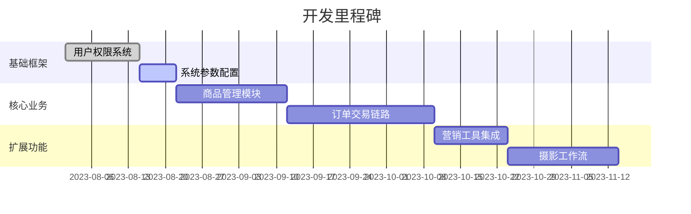
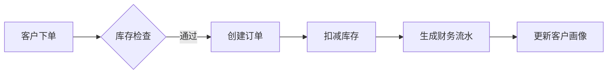

# 《影楼管理系统开发》
然后在所有使用这些枚举的文件中，将导入源从 '@prisma/client' 改为使用我们的本地枚举文件
import { OrderStatus, Role, PaymentStatus /* etc */ } from '../../shared/enums';
---

# 影楼管理系统开发

## 一、技术架构设计原则
1. **全栈类型安全**：采用 TypeScript 统一前后端开发。
2. **开发效率优先**：结合低代码配置与 AI 辅助开发。
3. **渐进式演进**：优先开发核心功能，扩展功能采用模块化设计。
4. **生产就绪**：内置性能优化与安全最佳实践。

## 二、技术栈选型优化

| 层级       | 技术方案                                                                 | 关键优势                                                                 |
|------------|--------------------------------------------------------------------------|--------------------------------------------------------------------------|
| **前端**   | React 18 + TypeScript + Vite + Ant Design Pro Components                | 企业级组件、动态主题、内置 ProTable 等高级组件                           |
| **后端**   | NestJS 9 + TypeScript                                                   | 开箱即用的模块化架构、CLI 工具、兼容 Express 中间件                     |
| **数据库** | PostgreSQL（主库）+ Redis（缓存/会话）                                  | 简化存储架构、ACID 事务支持、JSONB 扩展性                                |
| **接口**   | RESTful API + Swagger + Zod                                             | 自动生成文档、前后端类型共享                                             |
| **工具链** | Prisma + pnpm + TurboRepo                                               | 高速依赖管理、Monorepo 支持、类型安全 ORM                                |

---

## 三、前端 Web 功能模块

### 1. 首页
- **功能描述**：显示系统总体概况，包括实时统计数据、热点商品推荐、功能快捷入口等；提供系统核心指标的可视化展示，如订单数量、销售额、库存状态等；快速导航至核心功能模块，提升操作效率。

### 2. 商品管理
- **功能描述**：展示商品主图、名称、价格、描述及用户评价，支持图片轮播和规格选择；支持商品的新增、修改、删除操作，以及分类管理；提供商品详情页的管理，包括商品描述、参数配置、库存管理等功能；支持批量导入和导出商品数据，提升管理效率。

### 3. 订单管理
- **功能描述**：展示用户订单列表，支持订单详情查询、状态更新、订单备注等功能；提供订单筛选和排序功能，快速定位特定订单；支持订单的批量操作，如批量发货、批量退款等；提供订单状态的实时跟踪，确保订单处理的透明性和高效性。

### 4. 库存管理
- **功能描述**：实时监控库存状态，提供低库存预警功能，便于及时补货；支持库存的入库、出库操作，记录库存变动日志；提供库存盘点功能，确保库存数据的准确性；支持多仓库管理，灵活配置库存分布。

### 5. 财务统计
- **功能描述**：显示订单对应的财务流水、支付状态及统计图表；提供各类财务报表和图表，如销售额统计、利润分析、成本核算等；支持数据表打印、导入、导出功能，满足财务审计需求；提供数据分析决策支持，帮助管理层制定财务策略。

### 6. 营销管理
- **功能描述**：负责促销活动、广告推广和优惠策略的设置与管理；提供盲盒抽奖管理，包括规则说明、参数设定、抽奖入口和中奖记录展示；支持会员积分管理、优惠券管理、满减管理、团购管理等营销工具；可以将五种营销模式组合成多种复合营销方案，满足不同业务需求。

### 7. 摄影管理
- **功能描述**：管理摄影项目、拍摄任务及影像资源，确保摄影业务流程顺畅；提供拍摄任务的分配、进度跟踪和成果展示功能；支持影像资源的分类管理、标签化存储和快速检索；提供客户摄影需求的记录和跟踪功能，提升客户满意度。

### 8. 客户管理
- **功能描述**：管理客户信息，包括基本信息、联系方式、偏好设置等；提供客户订单历史查询和分析功能，了解客户消费行为；支持客户反馈的收集和处理，提升客户服务质量；提供客户分组和标签化管理，实现精准营销。

### 9. 员工管理
- **功能描述**：管理员工档案，包括基本信息、岗位职责、工作经历等；提供权限分配功能，根据岗位角色分配系统权限；支持绩效考核管理，记录员工工作表现和绩效数据；提供员工培训记录和职业发展规划功能，提升团队能力。

### 10. 用户管理
- **功能描述**：管理系统用户账号，包括用户注册、登录、权限分配等功能；提供角色管理功能，根据角色分配不同的系统权限；支持用户登录信息的记录和分析，确保系统安全；提供用户行为日志的查询和审计功能，便于问题追踪。

### 11. 系统设置
- **功能描述**：配置系统基础参数，如系统名称、默认语言、时区等；提供数据库备份和恢复功能，确保数据安全；支持日志管理，包括日志查询、下载和清理功能；提供安全设置，如密码策略、登录限制、数据加密等。

---

## 四、前端权限设计及开发顺序指导

### （一）用户权限体系设计

#### 1. 用户权限分类

| 权限角色          | 权限范围                                 | 核心操作描述                                                                                     |
|--------------------|------------------------------------------|--------------------------------------------------------------------------------------------------|
| **普通用户**       | 首页、客户管理                           | 查看系统概况、个人订单历史、客户信息维护                                                         |
| **客服人员**       | 首页、订单管理、客户管理                 | 处理订单状态更新、客户反馈响应、基础客户信息管理                                                 |
| **商品管理员**     | 商品管理、库存管理                       | 商品全生命周期管理（新增/编辑/下架）、库存调拨与预警处理                                         |
| **财务人员**       | 财务统计                                 | 财务报表生成/导出、支付流水核对、成本利润分析                                                    |
| **营销管理员**     | 营销管理                                 | 活动规则配置、优惠券发放、抽奖数据监控                                                           |
| **摄影管理员**     | 摄影管理                                 | 拍摄任务分配、影像资源归档、客户需求跟踪                                                         |
| **系统管理员**     | 所有模块                                 | 系统参数配置、权限分配、数据安全管理                                                             |

#### 2. 权限说明文案
"本系统采用分层权限控制模型，通过角色绑定功能模块实现精细化管控。普通用户仅开放基础数据查看权限，业务人员按职能划分数据操作范围（如客服人员可修改订单状态但无权访问财务数据），系统管理员拥有全局配置权限。所有敏感操作（如批量删除、数据导出）需二次身份验证。"

---

### （二）开发顺序指引（基于数据依赖关系）

#### 1. 基础框架层（Phase 1）
- **开发模块**：用户管理、角色权限模块、系统设置
- **理由**：
  1. 用户体系是所有业务模块的底层依赖。
  2. 权限控制需要贯穿整个开发过程。
  3. 系统参数表需提前定义（如单位、时区、日志格式）。

#### 2. 核心业务层（Phase 2）
- **开发顺序**：
  1. **商品管理模块** → **库存管理模块**
     - 商品表（SKU 信息、分类体系）是库存表的基础。
     - 需先建立商品-库存联动机制（如库存扣减规则）。
  2. **订单管理模块**
     - 依赖商品表（订单项关联 SKU）。
     - 需集成库存扣减接口。
  3. **财务统计模块**
     - 强依赖订单数据表结构。
     - 需建立订单-财务流水映射关系。

#### 3. 扩展业务层（Phase 3）
- **开发顺序**：
  1. **客户管理模块** → **营销管理模块**
     - 客户画像数据是营销策略的基础。
     - 需建立客户-营销活动关联模型。
  2. **摄影管理模块**
     - 独立业务单元，依赖基础用户体系。
     - 需设计影像资源存储结构。

#### 4. 辅助功能层（Phase 4）
- **开发模块**：员工管理、仪表盘首页
- **理由**：
  1. 员工档案依赖已稳定的用户表结构。
  2. 首页数据聚合需要各模块核心表完成建设。

---

### （三）关键数据依赖图谱
```
用户体系
  ├─▶ 商品管理 → 库存管理
  │      │
  │      └─▶ 订单管理 → 财务统计
  │
  ├─▶ 客户管理 → 营销管理
  │
  └─▶ 摄影管理（独立子域）
```

**特别说明**：建议采用**分阶段联调策略**，每个阶段完成后进行关联模块的接口测试（如完成商品模块后立即验证库存模块的联动逻辑），确保数据模型的一致性。

---

## 五、影楼管理系统开发方案

### （一）项目概述
- **目标**：构建覆盖影楼全业务流程的数字化管理系统，实现商品/订单/客户/摄影等核心业务闭环，提升运营效率 30%+。
- **范围**：包含 11 个核心功能模块，支持多角色协作的权限体系，提供数据驱动的决策支持能力。
- **价值**：
  - **业务线上化**：降低手工操作错误率。
  - **营销智能化**：5 种营销工具组合应用。
  - **资源可视化**：影像资产数字化管理。

---

### （二）技术架构设计

#### 1. 架构原则

| 原则                | 实施策略                                                                 |
|---------------------|--------------------------------------------------------------------------|
| 全栈类型安全        | TypeScript 统一前后端代码，Zod Schema 验证                               |
| 开发效率优先        | AntD Pro 组件库 + Prisma ORM，AI 辅助生成 CRUD 代码                      |
| 渐进式演进          | 模块化设计，核心功能支持插件式扩展                                       |
| 生产就绪            | 内置请求限流/SQL 注入防护，Prometheus 监控集成                           |

#### 2. 技术栈选型

| 层级       | 技术方案                           | 选型依据                                                                 |
|------------|------------------------------------|--------------------------------------------------------------------------|
| **前端**   | React 18 + AntD Pro + Vite         | 动态主题支持/ProTable 高级数据展示/热更新效率                             |
| **后端**   | NestJS + TypeScript                | 模块化架构/依赖注入支持/Express 中间件兼容                                |
| **数据库** | PostgreSQL + Kafka                 | JSONB 支持拍摄方案存储/消息队列解耦库存扣减                               |
| **接口**   | OpenAPI 3.0 + Zod                  | 自动生成 TypeScript 类型定义/SwaggerUI 文档                               |
| **DevOps** | Docker + GitLab CI                 | 容器化部署/流水线集成 SonarQube 代码检测                                 |

---

### （三）功能模块设计

#### 1. 核心业务矩阵

| 模块        | 关键实体                      | 核心接口示例                          | 技术特性                              |
|-------------|-------------------------------|---------------------------------------|---------------------------------------|
| 商品管理    | SKU/SPU/商品分类              | POST /api/products/batch-import       | 图片懒加载/规格组合算法               |
| 订单管理    | 订单/支付流水/物流信息        | PUT /api/orders/{id}/status           | 分布式事务管理库存扣减                |
| 摄影管理    | 拍摄任务/客户需求表/样片库    | GET /api/photo-tasks?status=pending   | 阿里云 OSS 存储集成/EXIF 元数据解析    |
| 营销管理    | 优惠券/满减规则/抽奖活动      | POST /api/coupons/generate-batch      | 营销组合策略模式/Redis 库存计数        |

#### 2. 数据看板设计
- **实时指标**：滚动显示当日订单量/成交金额/客户咨询量。
- **可视化组件**：
  - ECharts 销售趋势热力图
  - 库存水位预警仪表盘
  - 客户地域分布地图

---

### （四）权限体系设计

#### 1. RBAC 模型实现
```typescript
// 权限守卫示例
@UseGuards(RolesGuard)
@Post('orders')
@Roles(Role.STAFF, Role.ADMIN)
async createOrder(@Body() dto: CreateOrderDto) {
  // 业务逻辑
}
```

#### 2. 敏感操作审计
| 操作类型        | 审计策略                          | 日志存储                |
|-----------------|-----------------------------------|-------------------------|
| 数据导出        | 记录导出范围 + 操作用户           | Elasticsearch           |
| 权限变更        | 前后权限对比 + 变更人             | PostgreSQL 审计表       |
| 资金操作        | 操作截图 + 双因素认证记录         | 独立加密存储            |

---

### （五）开发实施计划

#### 1. 阶段规划


#### 2. 关键交付物
| 阶段       | 交付内容                          | 验收标准                              |
|------------|-----------------------------------|---------------------------------------|
| 框架验收   | 1. 权限管理系统<br>2. 基础数据模型 | 支持 5 种角色权限分配                   |
| 核心业务   | 1. 商品-订单-财务闭环<br>2. API 文档 | 完成 200+ 测试用例覆盖                  |
| 上线准备   | 1. 压力测试报告<br>2. 应急回滚方案 | 500 并发下响应时间 < 1s                  |

---

### （六）数据架构设计

#### 1. 关键数据流


#### 2. 存储方案
| 数据类型          | 存储方案                      | 性能优化措施                          |
|-------------------|-------------------------------|---------------------------------------|
| 商品信息          | PostgreSQL（主库）            | GIN 索引加速 JSONB 查询                  |
| 订单流水          | PostgreSQL（分表存储）        | 按月份水平分表                        |
| 影像文件          | 阿里云 OSS + CDN              | 图片智能压缩/分级存储策略              |
| 会话数据          | Redis Cluster                 | 热点数据本地缓存                      |

---

### （七）风险管理
| 风险项                | 应对措施                                  | 负责人       |
|-----------------------|-------------------------------------------|--------------|
| 库存超卖              | Redis 分布式锁 + 数据库乐观锁双重保障      | 后端开发组   |
| 营销规则冲突          | 规则引擎前置校验 + 灰度发布机制            | 架构师       |
| 影像数据安全          | OSS 权限策略 + 水印添加 + 访问日志审计     | 运维团队     |

---

### （八）项目交付
1. **交付清单**：
   - 系统源码（包含完整的 CI/CD 配置）
   - 自动化测试用例集（Postman + Jest）
   - 运维监控套件（Prometheus + Grafana 看板）

---