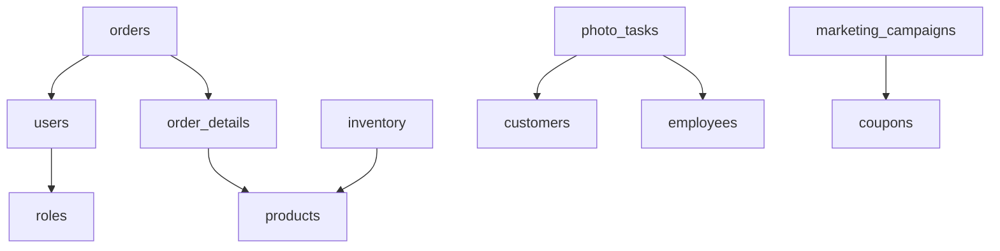

根据《影楼管理系统开发》方案，以下是为该系统设计的数据库词典。数据库设计主要围绕核心业务模块展开，包括商品管理、订单管理、库存管理、客户管理、摄影管理、营销管理等模块。数据库采用 PostgreSQL 作为主库，Redis 作为缓存和会话存储。

### 数据库词典

#### 1. 用户表（`users`）
| 字段名         | 数据类型       | 是否主键 | 是否外键 | 默认值 | 描述                     |
|----------------|----------------|----------|----------|--------|--------------------------|
| `id`           | SERIAL         | 是       | 否       | -      | 用户唯一标识符           |
| `username`     | VARCHAR(50)    | 否       | 否       | -      | 用户名                   |
| `password`     | VARCHAR(255)   | 否       | 否       | -      | 密码（加密存储）         |
| `email`        | VARCHAR(100)   | 否       | 否       | -      | 电子邮箱                 |
| `role_id`      | INT            | 否       | 是       | -      | 角色ID（外键关联`roles`）|
| `created_at`   | TIMESTAMP      | 否       | 否       | NOW()  | 创建时间                 |
| `updated_at`   | TIMESTAMP      | 否       | 否       | NOW()  | 更新时间                 |

#### 2. 角色表（`roles`）
| 字段名         | 数据类型       | 是否主键 | 是否外键 | 默认值 | 描述                     |
|----------------|----------------|----------|----------|--------|--------------------------|
| `id`           | SERIAL         | 是       | 否       | -      | 角色唯一标识符           |
| `role_name`    | VARCHAR(50)    | 否       | 否       | -      | 角色名称（如管理员、客服）|
| `permissions`  | TEXT           | 否       | 否       | -      | 角色权限（JSON格式）     |

#### 3. 商品表（`products`）
| 字段名         | 数据类型       | 是否主键 | 是否外键 | 默认值 | 描述                     |
|----------------|----------------|----------|----------|--------|--------------------------|
| `id`           | SERIAL         | 是       | 否       | -      | 商品唯一标识符           |
| `name`         | VARCHAR(100)   | 否       | 否       | -      | 商品名称                 |
| `description`  | TEXT           | 否       | 否       | -      | 商品描述                 |
| `price`        | DECIMAL(10,2)  | 否       | 否       | 0.00   | 商品价格                 |
| `category_id`  | INT            | 否       | 是       | -      | 商品分类ID（外键关联`categories`）|
| `created_at`   | TIMESTAMP      | 否       | 否       | NOW()  | 创建时间                 |
| `updated_at`   | TIMESTAMP      | 否       | 否       | NOW()  | 更新时间                 |

#### 4. 商品分类表（`categories`）
| 字段名         | 数据类型       | 是否主键 | 是否外键 | 默认值 | 描述                     |
|----------------|----------------|----------|----------|--------|--------------------------|
| `id`           | SERIAL         | 是       | 否       | -      | 分类唯一标识符           |
| `category_name`| VARCHAR(50)    | 否       | 否       | -      | 分类名称                 |

#### 5. 订单表（`orders`）
| 字段名         | 数据类型       | 是否主键 | 是否外键 | 默认值 | 描述                     |
|----------------|----------------|----------|----------|--------|--------------------------|
| `id`           | SERIAL         | 是       | 否       | -      | 订单唯一标识符           |
| `user_id`      | INT            | 否       | 是       | -      | 下单用户ID（外键关联`users`）|
| `order_date`   | TIMESTAMP      | 否       | 否       | NOW()  | 下单时间                 |
| `status`       | VARCHAR(20)    | 否       | 否       | -      | 订单状态（如待发货、已完成）|
| `total_amount` | DECIMAL(10,2)  | 否       | 否       | 0.00   | 订单总金额               |

#### 6. 订单明细表（`order_details`）
| 字段名         | 数据类型       | 是否主键 | 是否外键 | 默认值 | 描述                     |
|----------------|----------------|----------|----------|--------|--------------------------|
| `id`           | SERIAL         | 是       | 否       | -      | 订单明细唯一标识符       |
| `order_id`     | INT            | 否       | 是       | -      | 订单ID（外键关联`orders`）|
| `product_id`   | INT            | 否       | 是       | -      | 商品ID（外键关联`products`）|
| `quantity`     | INT            | 否       | 否       | 0      | 商品数量                 |
| `unit_price`   | DECIMAL(10,2)  | 否       | 否       | 0.00   | 商品单价                 |

#### 7. 库存表（`inventory`）
| 字段名         | 数据类型       | 是否主键 | 是否外键 | 默认值 | 描述                     |
|----------------|----------------|----------|----------|--------|--------------------------|
| `id`           | SERIAL         | 是       | 否       | -      | 库存唯一标识符           |
| `product_id`   | INT            | 否       | 是       | -      | 商品ID（外键关联`products`）|
| `quantity`     | INT            | 否       | 否       | 0      | 库存数量                 |
| `updated_at`   | TIMESTAMP      | 否       | 否       | NOW()  | 最后更新时间             |

#### 8. 客户表（`customers`）
| 字段名         | 数据类型       | 是否主键 | 是否外键 | 默认值 | 描述                     |
|----------------|----------------|----------|----------|--------|--------------------------|
| `id`           | SERIAL         | 是       | 否       | -      | 客户唯一标识符           |
| `first_name`   | VARCHAR(50)    | 否       | 否       | -      | 客户名字                 |
| `last_name`    | VARCHAR(50)    | 否       | 否       | -      | 客户姓氏                 |
| `email`        | VARCHAR(100)   | 否       | 否       | -      | 客户邮箱                 |
| `phone`        | VARCHAR(20)    | 否       | 否       | -      | 客户电话                 |
| `created_at`   | TIMESTAMP      | 否       | 否       | NOW()  | 注册时间                 |

#### 9. 摄影任务表（`photo_tasks`）
| 字段名         | 数据类型       | 是否主键 | 是否外键 | 默认值 | 描述                     |
|----------------|----------------|----------|----------|--------|--------------------------|
| `id`           | SERIAL         | 是       | 否       | -      | 摄影任务唯一标识符       |
| `customer_id`  | INT            | 否       | 是       | -      | 客户ID（外键关联`customers`）|
| `task_date`    | DATE           | 否       | 否       | -      | 拍摄日期                 |
| `status`       | VARCHAR(20)    | 否       | 否       | -      | 任务状态（如待拍摄、已完成）|
| `assigned_to`  | INT            | 否       | 是       | -      | 分配给的员工ID（外键关联`employees`）|

#### 10. 员工表（`employees`）
| 字段名         | 数据类型       | 是否主键 | 是否外键 | 默认值 | 描述                     |
|----------------|----------------|----------|----------|--------|--------------------------|
| `id`           | SERIAL         | 是       | 否       | -      | 员工唯一标识符           |
| `first_name`   | VARCHAR(50)    | 否       | 否       | -      | 员工名字                 |
| `last_name`    | VARCHAR(50)    | 否       | 否       | -      | 员工姓氏                 |
| `position`     | VARCHAR(50)    | 否       | 否       | -      | 员工职位                 |
| `email`        | VARCHAR(100)   | 否       | 否       | -      | 员工邮箱                 |

#### 11. 营销活动表（`marketing_campaigns`）
| 字段名         | 数据类型       | 是否主键 | 是否外键 | 默认值 | 描述                     |
|----------------|----------------|----------|----------|--------|--------------------------|
| `id`           | SERIAL         | 是       | 否       | -      | 营销活动唯一标识符       |
| `campaign_name`| VARCHAR(100)   | 否       | 否       | -      | 活动名称                 |
| `start_date`   | DATE           | 否       | 否       | -      | 活动开始日期             |
| `end_date`     | DATE           | 否       | 否       | -      | 活动结束日期             |
| `description`  | TEXT           | 否       | 否       | -      | 活动描述                 |

#### 12. 优惠券表（`coupons`）
| 字段名         | 数据类型       | 是否主键 | 是否外键 | 默认值 | 描述                     |
|----------------|----------------|----------|----------|--------|--------------------------|
| `id`           | SERIAL         | 是       | 否       | -      | 优惠券唯一标识符         |
| `code`         | VARCHAR(50)    | 否       | 否       | -      | 优惠券代码               |
| `discount`     | DECIMAL(5,2)   | 否       | 否       | 0.00   | 折扣金额或比例           |
| `valid_from`   | DATE           | 否       | 否       | -      | 有效期开始日期           |
| `valid_to`     | DATE           | 否       | 否       | -      | 有效期结束日期           |

#### 13. 财务流水表（`financial_transactions`）
| 字段名         | 数据类型       | 是否主键 | 是否外键 | 默认值 | 描述                     |
|----------------|----------------|----------|----------|--------|--------------------------|
| `id`           | SERIAL         | 是       | 否       | -      | 财务流水唯一标识符       |
| `order_id`     | INT            | 否       | 是       | -      | 订单ID（外键关联`orders`）|
| `amount`       | DECIMAL(10,2)  | 否       | 否       | 0.00   | 交易金额                 |
| `transaction_date` | TIMESTAMP | 否       | 否       | NOW()  | 交易时间                 |
| `status`       | VARCHAR(20)    | 否       | 否       | -      | 交易状态（如成功、失败） |

#### 14. 系统设置表（`system_settings`）
| 字段名         | 数据类型       | 是否主键 | 是否外键 | 默认值 | 描述                     |
|----------------|----------------|----------|----------|--------|--------------------------|
| `id`           | SERIAL         | 是       | 否       | -      | 设置项唯一标识符         |
| `setting_name` | VARCHAR(100)   | 否       | 否       | -      | 设置项名称               |
| `setting_value`| TEXT           | 否       | 否       | -      | 设置项值                 |

### 数据库关系图

### 数据库索引优化
- **商品表**：为`category_id`字段创建索引，加速分类查询。
- **订单表**：为`user_id`和`status`字段创建索引，加速用户订单查询和状态筛选。
- **库存表**：为`product_id`字段创建索引，加速商品库存查询。
- **客户表**：为`email`和`phone`字段创建索引，加速客户信息检索。
- **摄影任务表**：为`customer_id`和`assigned_to`字段创建索引，加速任务分配和客户任务查询。

### 数据库备份与恢复策略
- **备份策略**：每天凌晨自动备份数据库，备份文件存储在阿里云OSS。
- **恢复策略**：支持从备份文件恢复数据，提供完整的备份日志以供审计。

以上数据库设计基于影楼管理系统的核心业务需求，确保数据的完整性、一致性和安全性。